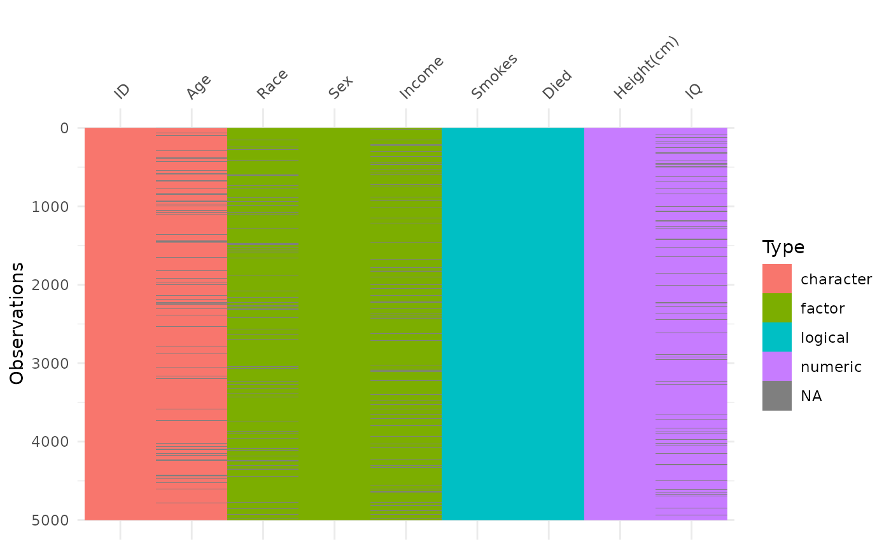
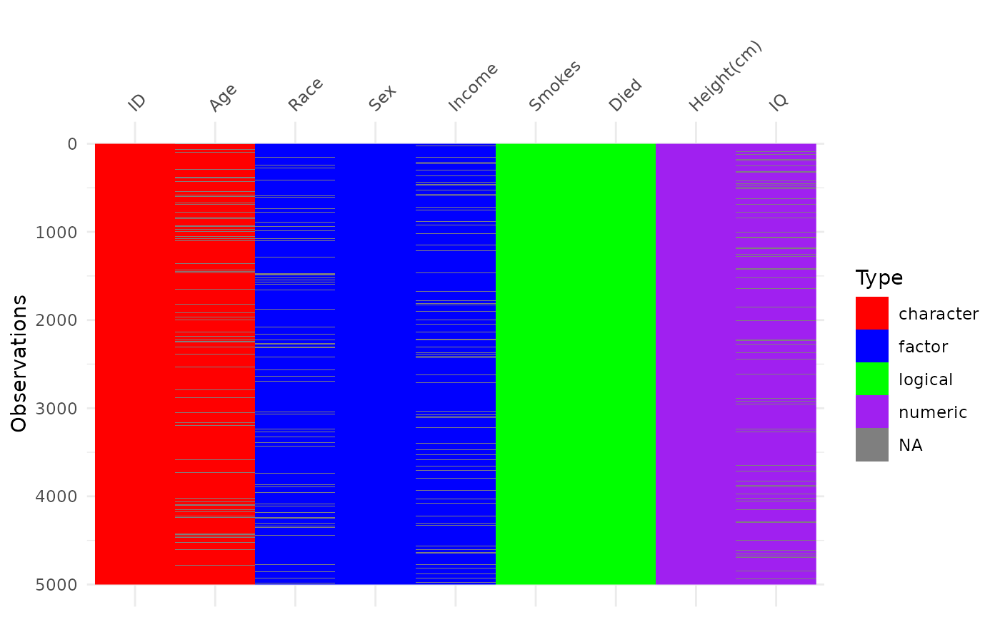
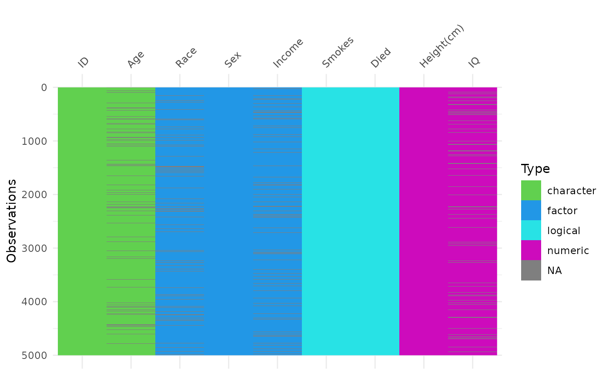
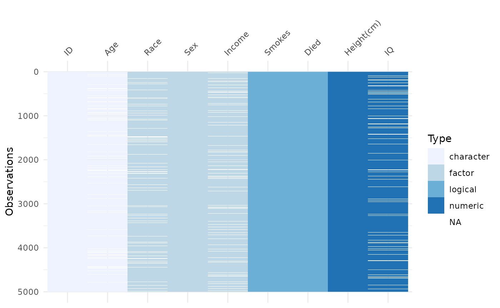
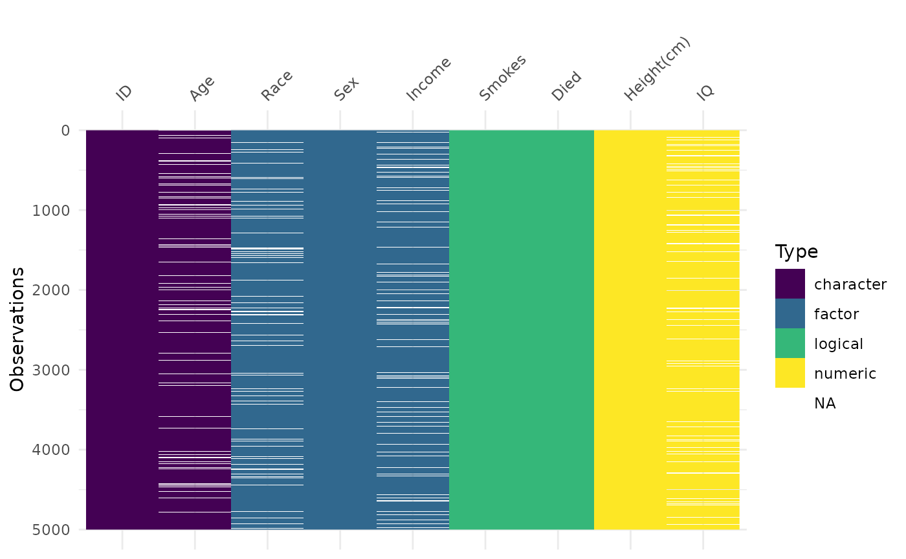

# Customising colour palettes in visdat

``` r

library(visdat)
```

## How to provide your own colour palette?

This vignette shoes you how to provide your own colour palette with
`visdat`.

A `visdat` plot is a `ggplot` object - so we can use the tools from
ggplot to tinker with colours. In this case, that is the
`scale_fill_manual` function.

A “standard” visdat plot might be like so:

``` r

vis_dat(typical_data)
```



You can name the colours yourself like so (after first loading the
`ggplot` package.

``` r

library(ggplot2)
vis_dat(typical_data) +
  scale_fill_manual(
    values = c(
      "character" = "red",
      "factor" = "blue",
      "logical" = "green",
      "numeric" = "purple",
      "NA" = "gray"
  ))
```



This is a pretty, uh, “popping” set of colours? You can also use some
hex colours instead.

Say, taken from [`palette()`](https://rdrr.io/r/grDevices/palette.html):

``` r

palette()
#> [1] "black"   "#DF536B" "#61D04F" "#2297E6" "#28E2E5" "#CD0BBC" "#F5C710"
#> [8] "gray62"
```

``` r

vis_dat(typical_data) +
  scale_fill_manual(
    values = c(
      "character" = "#61D04F",
      "factor" = "#2297E6",
      "logical" = "#28E2E5",
      "numeric" = "#CD0BBC",
      "NA" = "#F5C710"
  ))
```



How can we get nicer ones?

Well, you can use any of `ggplot`’s `scale_fill_*` functions from inside
ggplot2

For example:

``` r

vis_dat(typical_data) +
  scale_fill_brewer()
#> Warning: Removed 2000 rows containing missing values or values outside the scale range
#> (`geom_raster()`).
```



``` r

vis_dat(typical_data) +
  scale_fill_viridis_d()
#> Warning: Removed 2000 rows containing missing values or values outside the scale range
#> (`geom_raster()`).
```



Happy colour palette exploring! You might want to take a look at some of
the following colour palettes from other packages:

- [scico](https://github.com/thomasp85/scico#ggplot2-support)
- [colorspace](https://cran.r-project.org/package=colorspace/vignettes/colorspace.html#Usage_with_ggplot2)
- [wesanderson](https://github.com/karthik/wesanderson#palettes)
