# Using visdat

When you get a new data set, you need to look at the data to get a sense
of what it contains and potential problems with it. That’s a key phrase
here “looking at the data” - what does that mean?

On the one hand, you can look at the head of the data:

``` r

head(iris)
```

    ##   Sepal.Length Sepal.Width Petal.Length Petal.Width Species
    ## 1          5.1         3.5          1.4         0.2  setosa
    ## 2          4.9         3.0          1.4         0.2  setosa
    ## 3          4.7         3.2          1.3         0.2  setosa
    ## 4          4.6         3.1          1.5         0.2  setosa
    ## 5          5.0         3.6          1.4         0.2  setosa
    ## 6          5.4         3.9          1.7         0.4  setosa

Or you can have a `glimpse` at it through
[`dplyr::glimpse`](https://pillar.r-lib.org/reference/glimpse.html)

``` r

library(dplyr)
```

    ## 
    ## Attaching package: 'dplyr'

    ## The following objects are masked from 'package:stats':
    ## 
    ##     filter, lag

    ## The following objects are masked from 'package:base':
    ## 
    ##     intersect, setdiff, setequal, union

``` r

glimpse(iris)
```

    ## Rows: 150
    ## Columns: 5
    ## $ Sepal.Length <dbl> 5.1, 4.9, 4.7, 4.6, 5.0, 5.4, 4.6, 5.0, 4.4, 4.9, 5.4, 4.…
    ## $ Sepal.Width  <dbl> 3.5, 3.0, 3.2, 3.1, 3.6, 3.9, 3.4, 3.4, 2.9, 3.1, 3.7, 3.…
    ## $ Petal.Length <dbl> 1.4, 1.4, 1.3, 1.5, 1.4, 1.7, 1.4, 1.5, 1.4, 1.5, 1.5, 1.…
    ## $ Petal.Width  <dbl> 0.2, 0.2, 0.2, 0.2, 0.2, 0.4, 0.3, 0.2, 0.2, 0.1, 0.2, 0.…
    ## $ Species      <fct> setosa, setosa, setosa, setosa, setosa, setosa, setosa, s…

Here we see that we have doubles, and a factor. We get some insight into
the data.

But we don’t always have data like the canonical iris dataset. let’s
take a look at some data that might be a bit more typical of “messy”
data using the `typical_data` dataset from the `visdat` package.

``` r

library(visdat)

glimpse(typical_data)
```

    ## Rows: 5,000
    ## Columns: 9
    ## $ ID           <chr> "0001", "0002", "0003", "0004", "0005", "0006", "0007", "…
    ## $ Race         <fct> Black, Black, Black, Hispanic, NA, White, White, Black, W…
    ## $ Age          <chr> NA, "25", "31", "27", "21", "22", "23", "21", NA, "27", "…
    ## $ Sex          <fct> Male, Male, Female, Female, Female, Female, Female, Femal…
    ## $ `Height(cm)` <dbl> 175.9, 171.7, 173.5, 172.4, 158.5, 169.5, 163.7, 165.8, 1…
    ## $ IQ           <dbl> 110, 84, 115, 84, 116, 83, 101, 97, 92, 99, 88, 86, NA, 9…
    ## $ Smokes       <lgl> FALSE, TRUE, FALSE, FALSE, FALSE, FALSE, FALSE, FALSE, FA…
    ## $ Income       <fct> 4334.29, 16682.37, 50402.01, 91442.86, 75266.05, 12209.71…
    ## $ Died         <lgl> FALSE, TRUE, FALSE, FALSE, FALSE, FALSE, FALSE, FALSE, TR…

Looking at this, you might then ask:

> Isn’t it odd that Income is a factor? And Age is a character?

And you might start to wonder what else is different, what else changed?

And it might be a bit unclear where to go from there. Do you plot the
data? Why does my plot look weird? What are these other strange features
in the data? The `visdat` package provides visualisations of an entire
dataframe at once. Initially inspired by
[`csv-fingerprint`](https://github.com/setosa/csv-fingerprint), `visdat`
provides tools to create heatmap-like visualisations of an entire
dataframe. `visdat` provides 2 main functions: `vis_dat` and `vis_miss`.

[`vis_dat()`](https://docs.ropensci.org/visdat/reference/vis_dat.md)
helps explore the data class structure and missingness:

``` r

vis_dat(typical_data)
```


And the `vis_miss` function provides a custom plot for missing data.

``` r

vis_miss(typical_data)
```

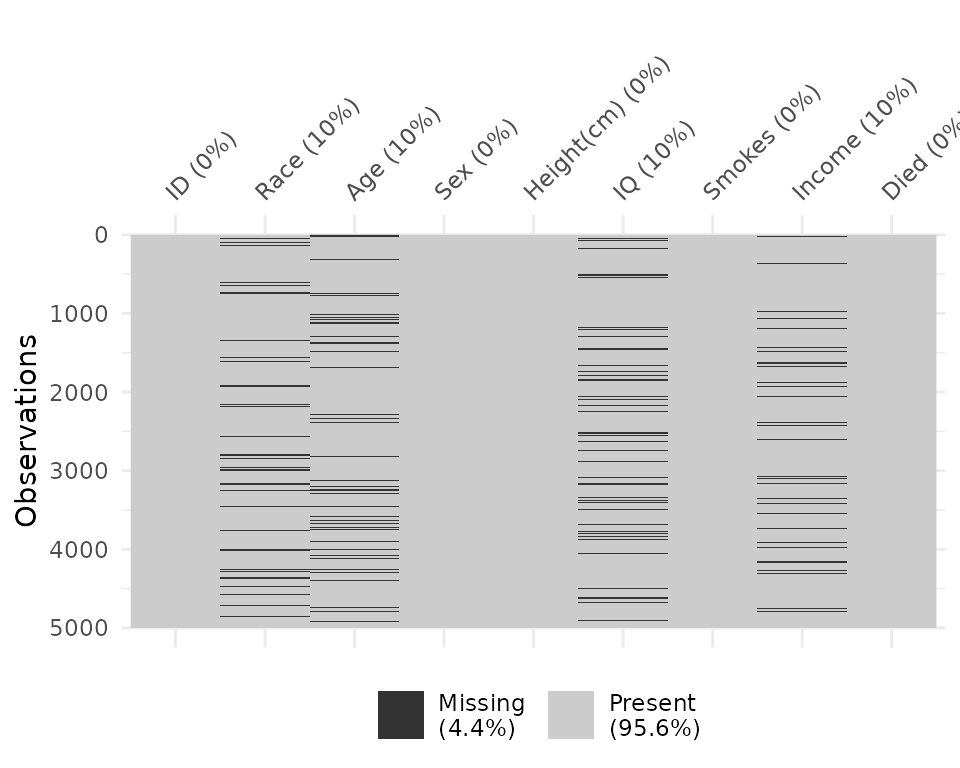

The name `visdat` was chosen as it borrows from the idea of
[`testdat`](https://github.com/karthik/testdat), which provides unit
testing for your data. In a similar way, `visdat` provides visual tests,
the idea being that first you visualise your data (`visdat`), then you
run tests from `testdat`, or a package like `assertr`, to fix these
errors.

### `vis_dat`

Let’s see what’s inside the dataset `airquality`, which contains
information about daily air quality measurements in New York from May to
September 1973. More information about the dataset can be found with
[`?airquality`](https://rdrr.io/r/datasets/airquality.html).

``` r

vis_dat(airquality)
```

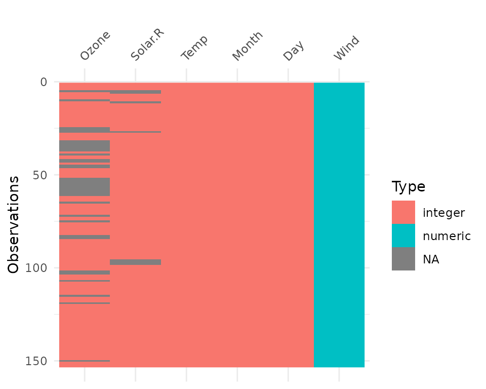 The plot above tells
us that R reads this dataset as having numeric and integer values, with
some missing data in `Ozone` and `Solar.R`. The classes are represented
on the legend, and missing data represented by grey. The column/variable
names are listed on the x axis.

By default, `vis_dat` sorts the columns according to the type of the
data in the vectors. You can turn this off by setting
`sort_type = FALSE`. This feature is better illustrated using the
`typical_data` dataset, created using
[wakefield](https://github.com/trinker/wakefield) and contained within
`visdat`.

``` r

vis_dat(typical_data)
```

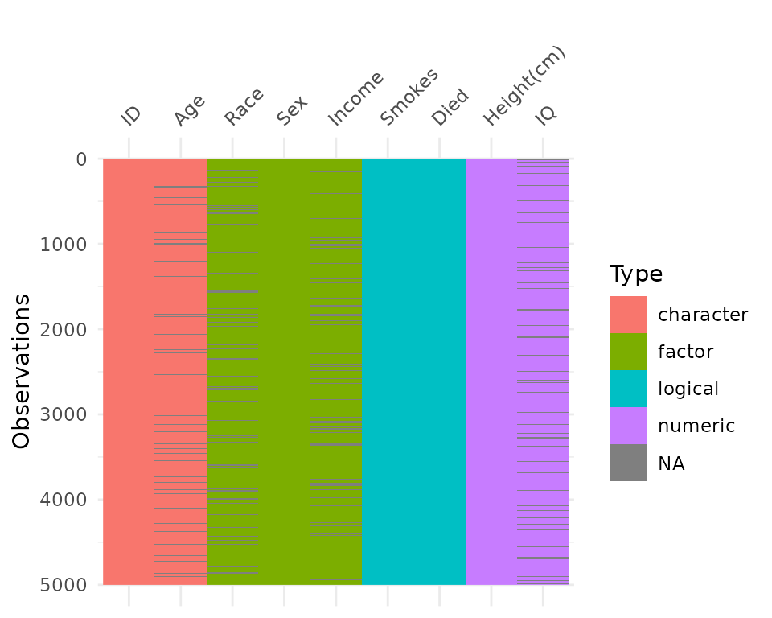

``` r

vis_dat(typical_data, 
        sort_type = FALSE)
```

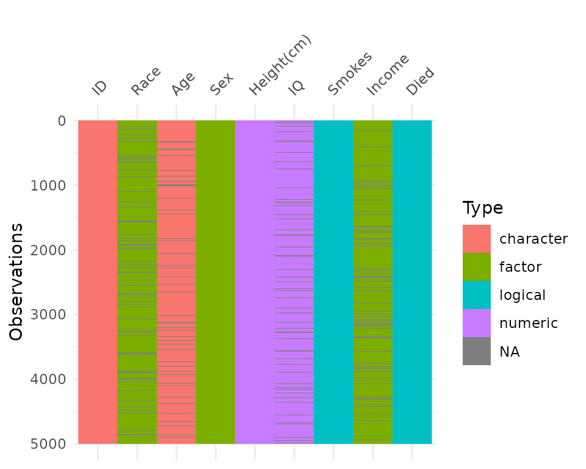

### `vis_miss`

We can explore the missing data further using `vis_miss`.

``` r

vis_miss(airquality)
```


Notice that the percentages of missingness are provided in the data.
These are accurate to 1 decimal place. `vis_miss` indicates when there
is a very small amount of missing data at \<0.1% missingness.

``` r

df_test <- data.frame(x1 = 1:10000,
                      x2 = rep("A", 10000),
                      x3 = c(rep(1L, 9999), NA))

vis_miss(df_test)
```

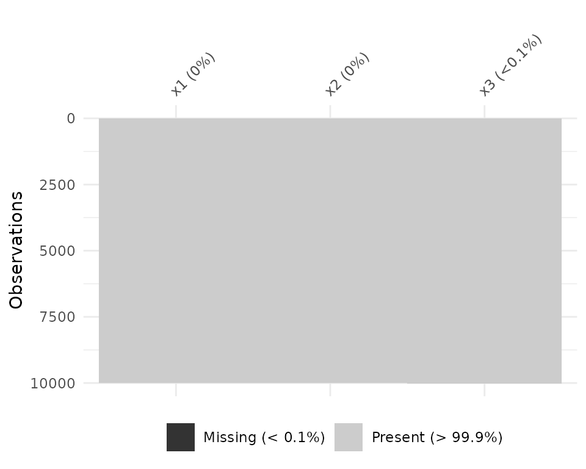

`vis_miss` will also indicate when there is no missing data at all.

``` r

df_test <- data.frame(x1 = 1:10000,
                      x2 = rep("tidy", 10000),
                      x3 = rep("data", 10000))

vis_miss(df_test)
```

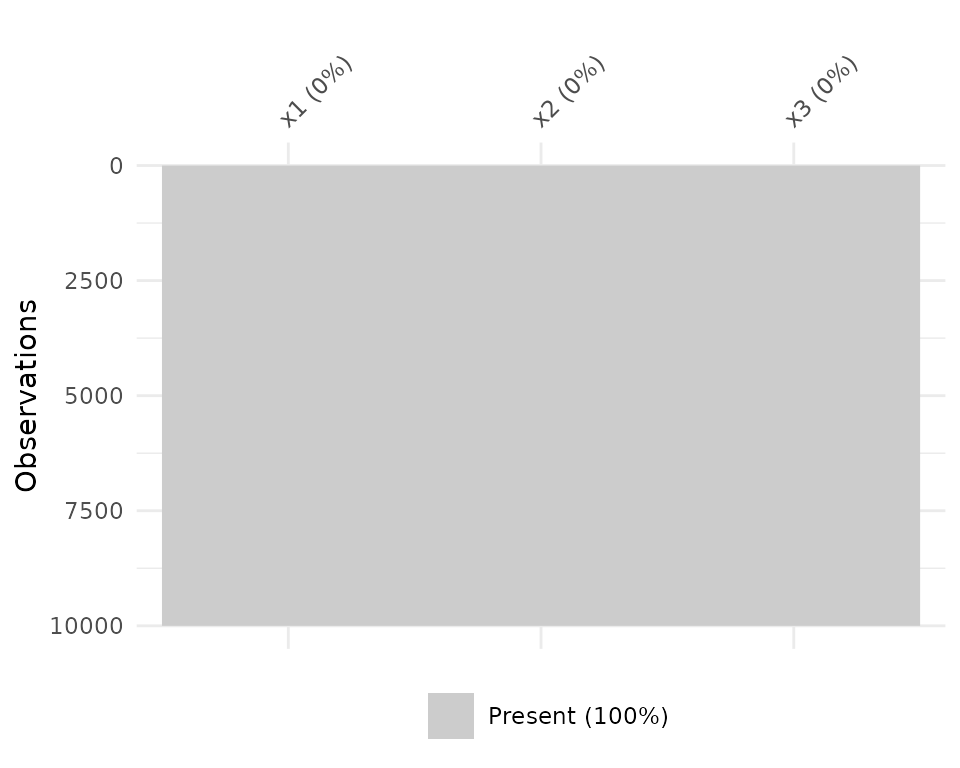

Columns can be arranged by columns with most missingness, by setting
`sort_miss = TRUE`.

``` r

vis_miss(airquality,
         sort_miss = TRUE)
```

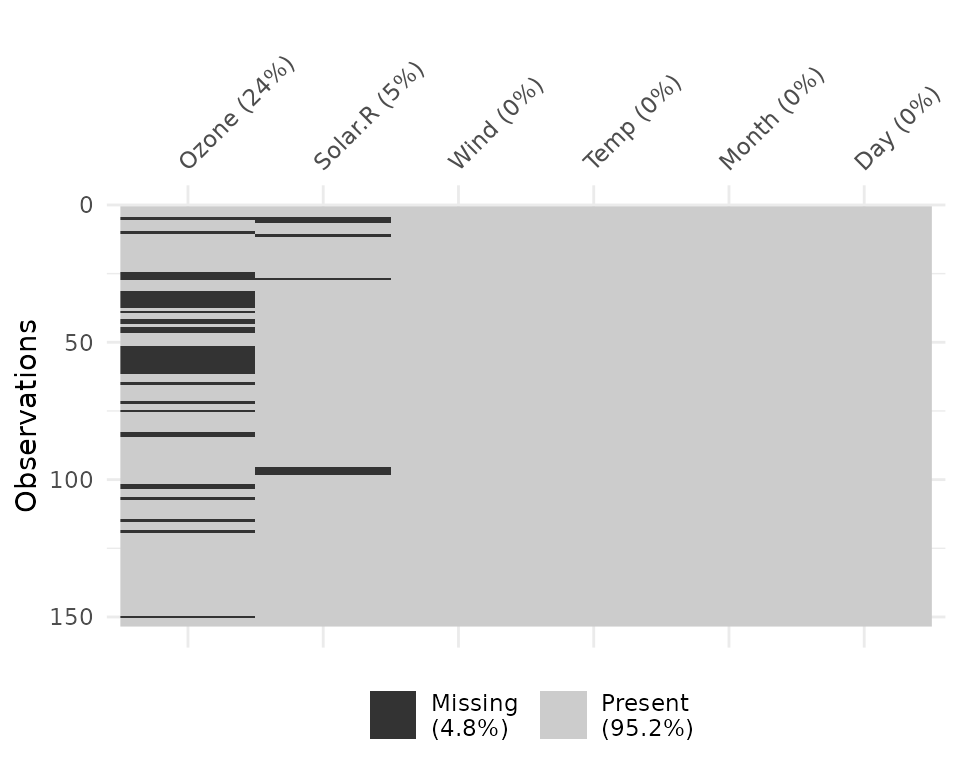

And missingness can be clustered by setting `cluster = TRUE`

``` r

vis_miss(airquality, 
         cluster = TRUE)
```

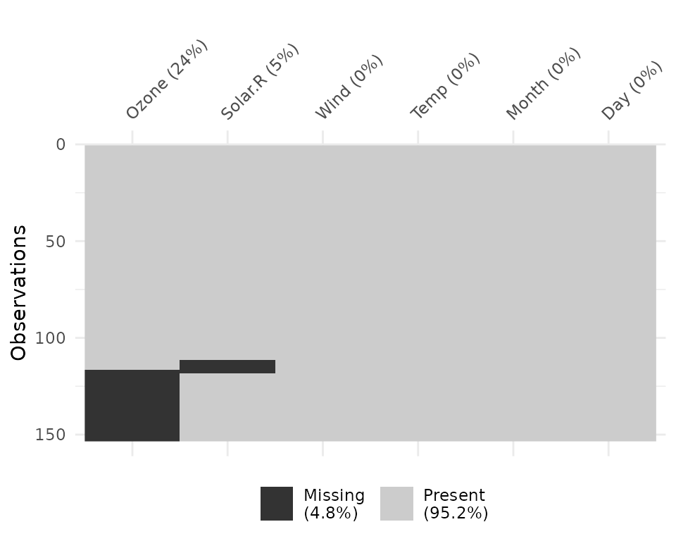

To further explore the missingness structure in a dataset, I recommend
the [`naniar`](https://github.com/njtierney/naniar) package, which
provides more general tools for graphical and numerical exploration of
missing values.

### `vis_compare`

Sometimes you want to see what has changed in your data.
[`vis_compare()`](https://docs.ropensci.org/visdat/reference/vis_compare.md)
displays the differences in two dataframes of the same size. Let’s look
at an example.

Let’s make some changes to the `chickwts`, and compare this new dataset.

``` r

set.seed(2019-04-03-1107)
chickwts_diff <- chickwts
rows_to_na <- sample(seq_len(nrow(chickwts)), 30)
cols_to_na <- sample(seq_len(ncol(chickwts)), 2)
chickwts_diff[rows_to_na, cols_to_na] <- NA

vis_compare(chickwts_diff, chickwts)
```

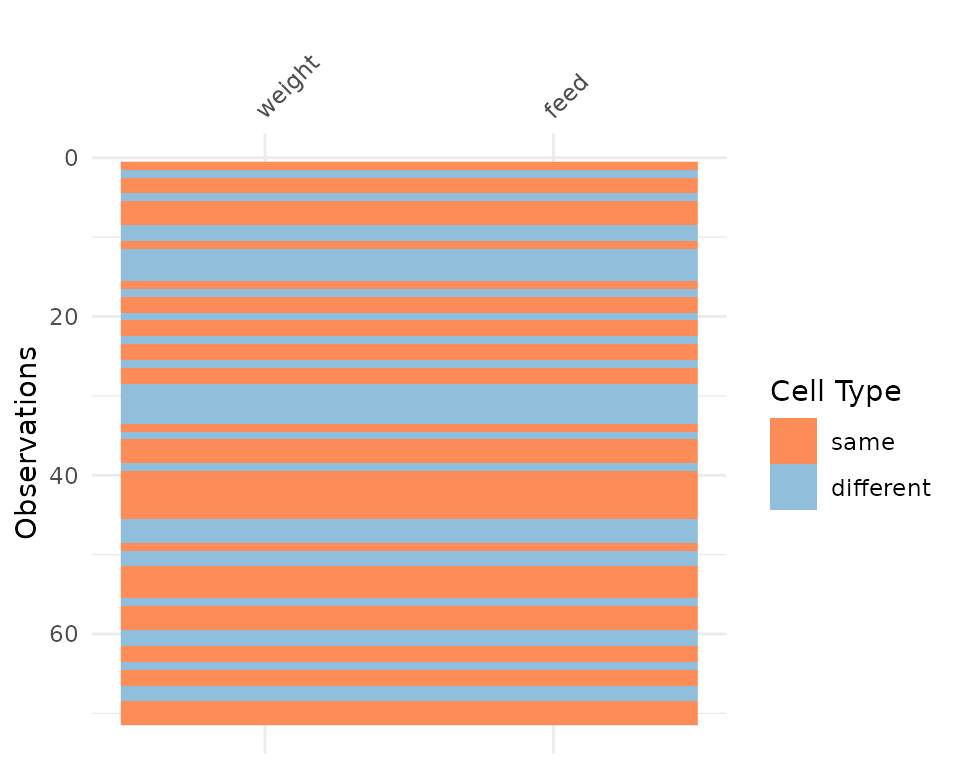

Here the differences are marked in blue.

If you try and compare differences when the dimensions are different,
you get an ugly error.

``` r

chickwts_diff_2 <- chickwts
chickwts_diff_2$new_col <- chickwts_diff_2$weight*2

vis_compare(chickwts, chickwts_diff_2)
# Error in vis_compare(chickwts, chickwts_diff_2) : 
#   Dimensions of df1 and df2 are not the same. vis_compare requires dataframes of identical dimensions.
```

### `vis_expect`

`vis_expect` visualises certain conditions or values in your data. For
example, If you are not sure whether to expect values greater than 25 in
your data (airquality), you could write:
`vis_expect(airquality, ~.x >= 25)`, and you can see if there are times
where the values in your data are greater than or equal to 25.

``` r

vis_expect(airquality, ~.x >= 25)
```

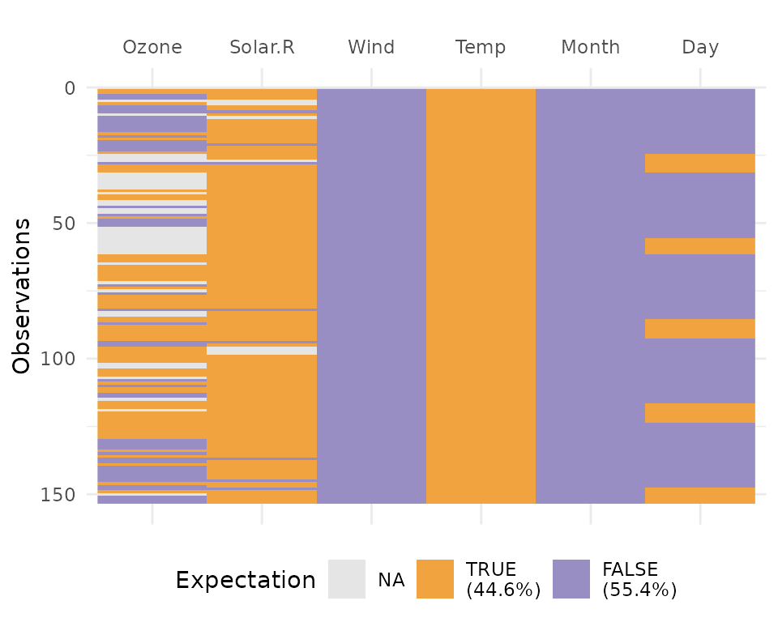

This shows the proportion of times that there are values greater than
25, as well as the missings.

You could also, for example, explore a set of bad strings, or possible
NA values and visualise where they are using
`vis_expect(data, ~.x %in% bad_strings)` where `bad_strings` is a
character vector containing bad strings like `N A`, `N/A` etc.

``` r

bad_data <- data.frame(x = c(rnorm(100), rep("N/A", 10)),
                       y = c(rep("N A ", 30), rnorm(80)))

vis_expect(bad_data, ~.x %in% c("N/A", "N A "))
```

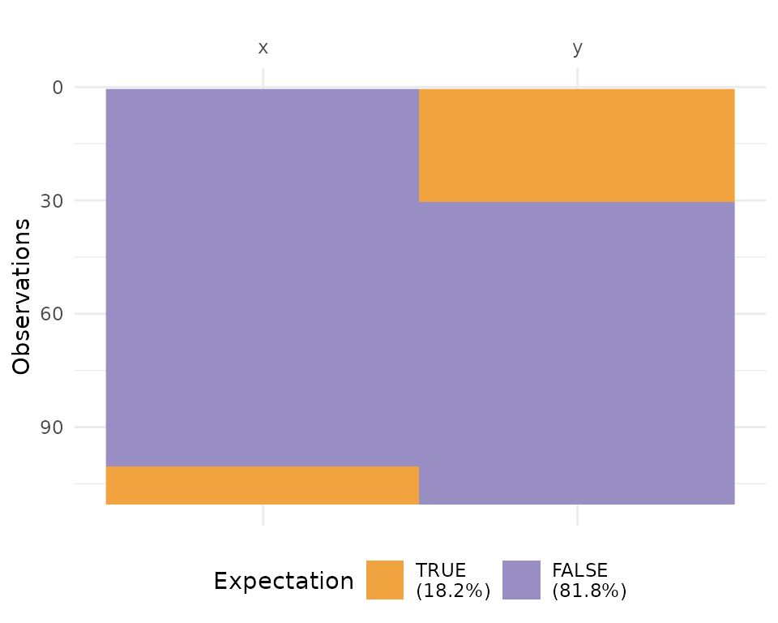

### `vis_cor`

To make it easy to plot correlations of your data, use `vis_cor`:

``` r

vis_cor(airquality)
```

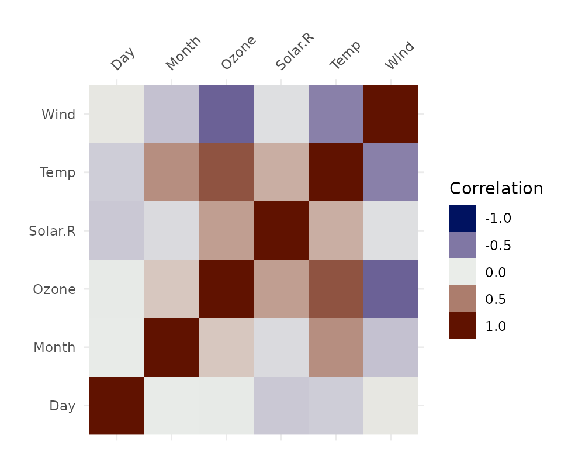

Under the hood, `vis_cor` is powered by the `cor` function in base R,
and takes a character string indicating which correlation coefficient
(or covariance) is to be computed. One of “pearson” (default),
“kendall”, or “spearman”.

``` r

vis_cor(airquality, cor_method = "spearman")
```

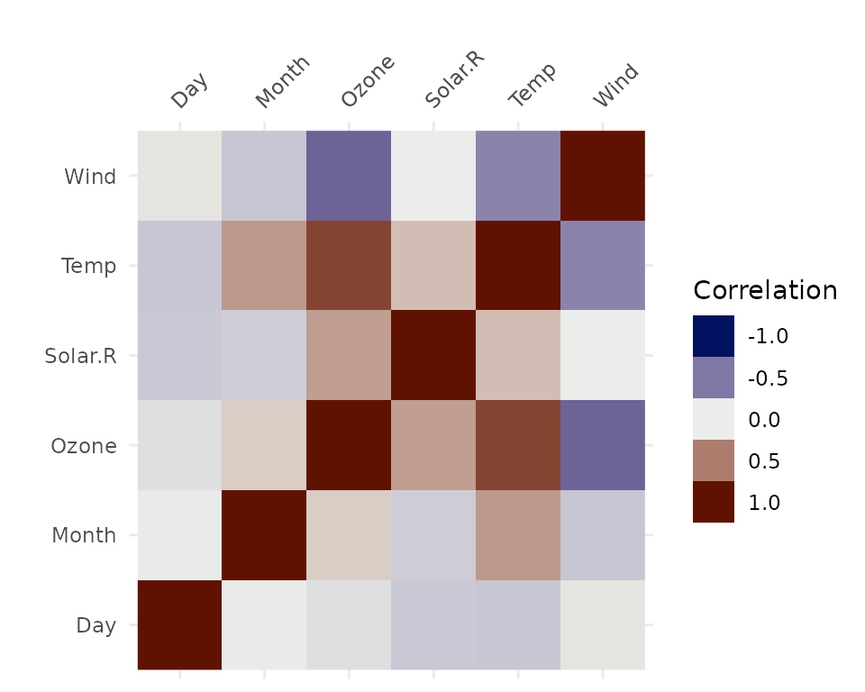

You can also specify what to do for the missing data using the
`na_action` function, which again borrows from the `cor` methods. This
can be “everything”, “all.obs”, “complete.obs”, “na.or.complete”, or
“pairwise.complete.obs” (default), e.g.:

``` r

vis_cor(airquality,
        na_action = "complete.obs")
```

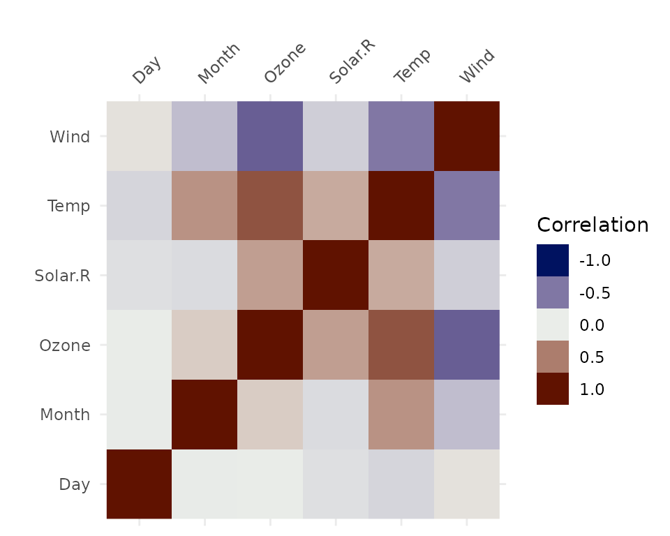

### `vis_value`

[`vis_value()`](https://docs.ropensci.org/visdat/reference/vis_value.md)
visualises the values of your data on a 0 to 1 scale.

``` r

vis_value(airquality)
```

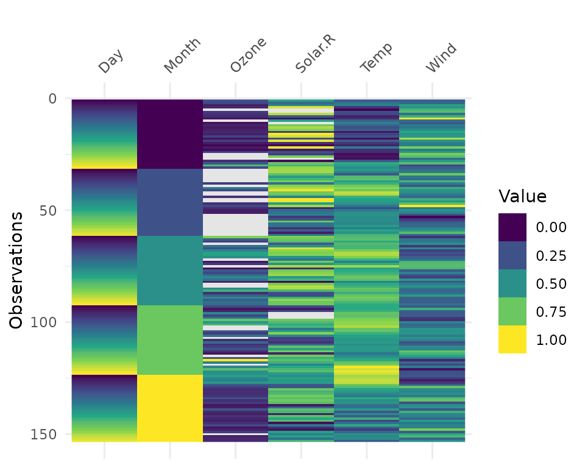

It only works on numeric data:

``` r

vis_value(iris)
```

    data input can only contain numeric values, please subset the data to the numeric values you would like. dplyr::select_if(data, is.numeric) can be helpful here!

So you might need to subset the data beforehand like so:

``` r

iris %>%
  select_if(is.numeric) %>%
  vis_value()
```

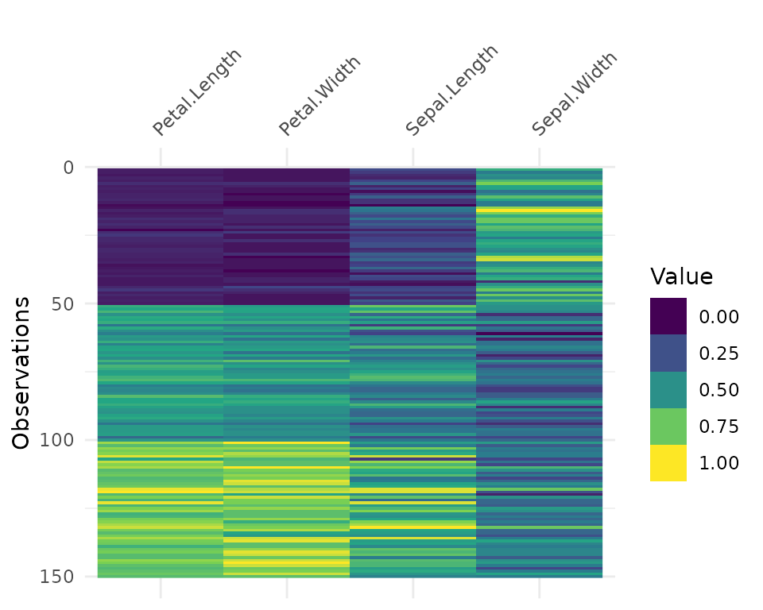

It can be useful to arrange your data before using `vis_value` to
explore possible relationships in the data:

``` r

airquality %>%
  arrange(Wind) %>%
  vis_value()
```

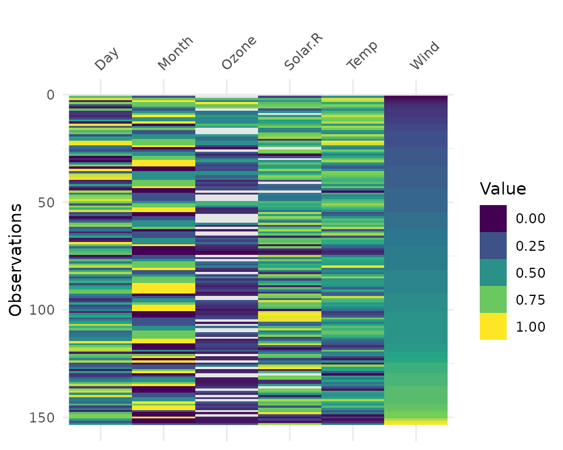

### `vis_binary`

[`vis_binary()`](https://docs.ropensci.org/visdat/reference/vis_binary.md)
visualises the occurrence of binary values in your data. It is similar
to
[`vis_value()`](https://docs.ropensci.org/visdat/reference/vis_value.md)
except it just focusses on values that are NA, 0, and 1.

``` r

vis_binary(dat_bin)
```

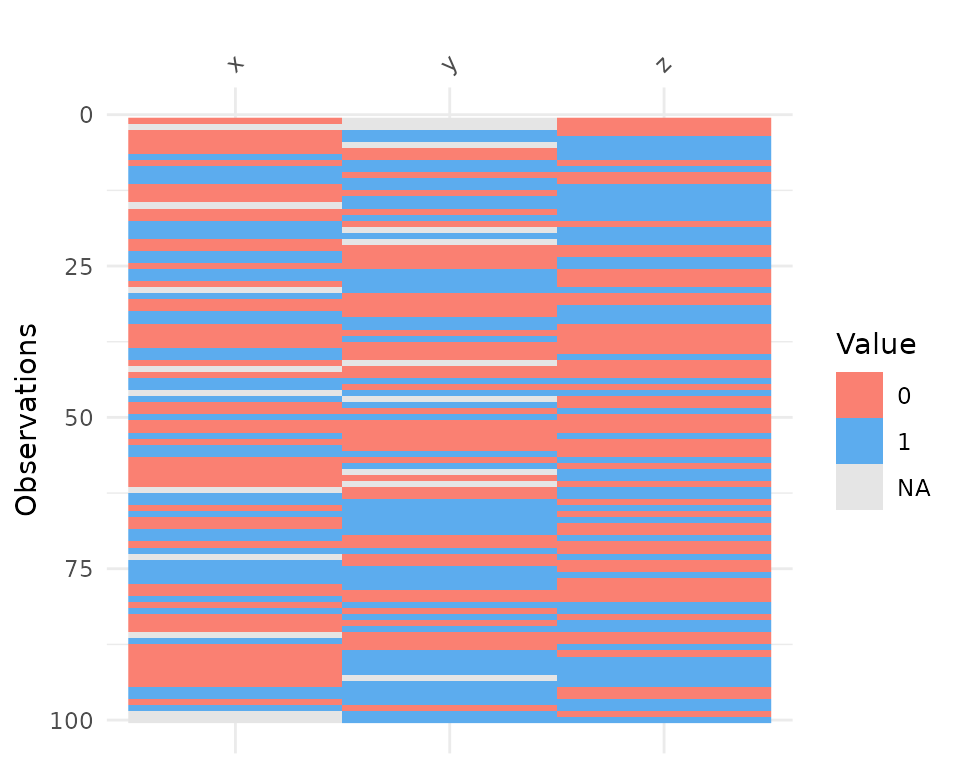

### `vis_guess`

[`vis_guess()`](https://docs.ropensci.org/visdat/reference/vis_guess.md)
takes a guess at what each cell is. It’s best illustrated using some
messy data, which we’ll make here.

``` r

messy_vector <- c(TRUE,
                  T,
                  "TRUE",
                  "T",
                  "01/01/01",
                  "01/01/2001",
                  NA,
                  NaN,
                  "NA",
                  "Na",
                  "na",
                  "10",
                  10,
                  "10.1",
                  10.1,
                  "abc",
                  "$%TG")

set.seed(1114)
messy_df <- data.frame(var1 = messy_vector,
                       var2 = sample(messy_vector),
                       var3 = sample(messy_vector))
```

``` r

vis_guess(messy_df)
vis_dat(messy_df)
```

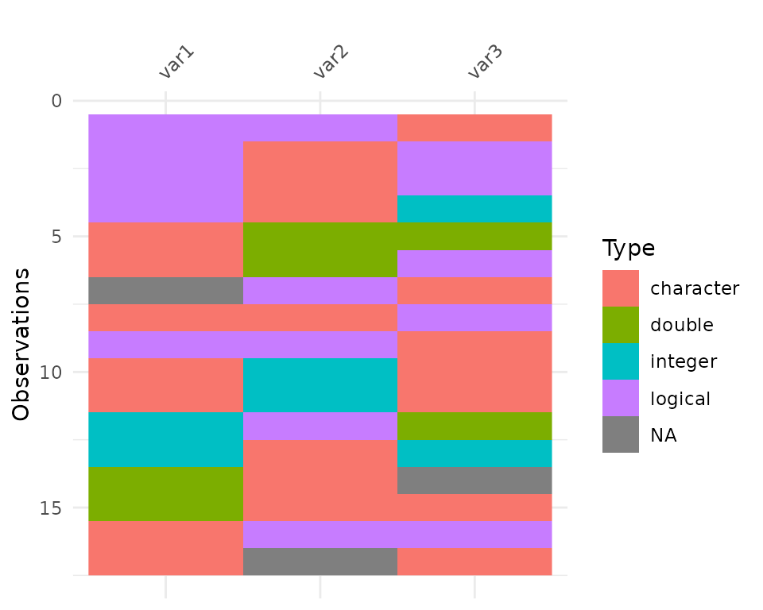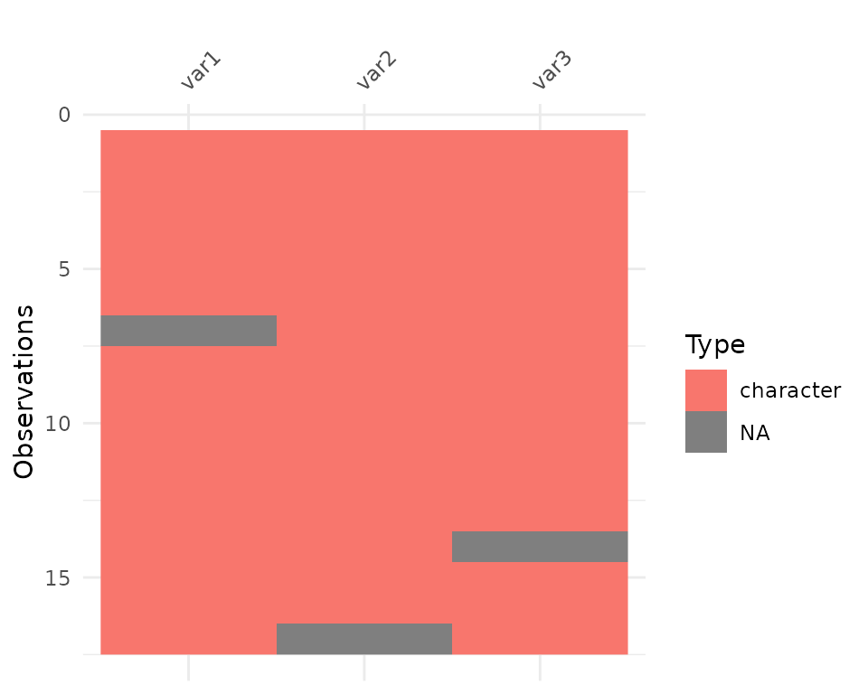

So here we see that there are many different kinds of data in your
dataframe. As an analyst this might be a depressing finding. We can see
this comparison above.

Here, you might just assume your data is weird because it’s all
factors - or worse, not notice that this is a problem.

At the moment `vis_guess` is very slow. Please take this into
consideration when you are using it on data with more than 1000 rows.
We’re looking into ways of making it faster, potentially using methods
from the `parallel` package, or extending the c++ code from
`readr:::collectorGuess`.

## Interactivity

You can make the plots in visdat by wrapping them in
[`plotly::ggplotly`](https://rdrr.io/pkg/plotly/man/ggplotly.html):

``` r

library(plotly)
ggplotly(vis_dat(airquality))
ggplotly(vis_miss(airquality))
ggplotly(vis_guess(airquality))
```

In the future these will have their own functions, written in plotly
with nice standardised on-hover behaviour. If you would like to see how
these work, please see the [development version on
GitHub](https://github.com/ropensci/visdat).

## Future work

Future work from here is focussed on making `visdat` more stable,
improving the speed of plotting, and adding interactive versions for
each function.
